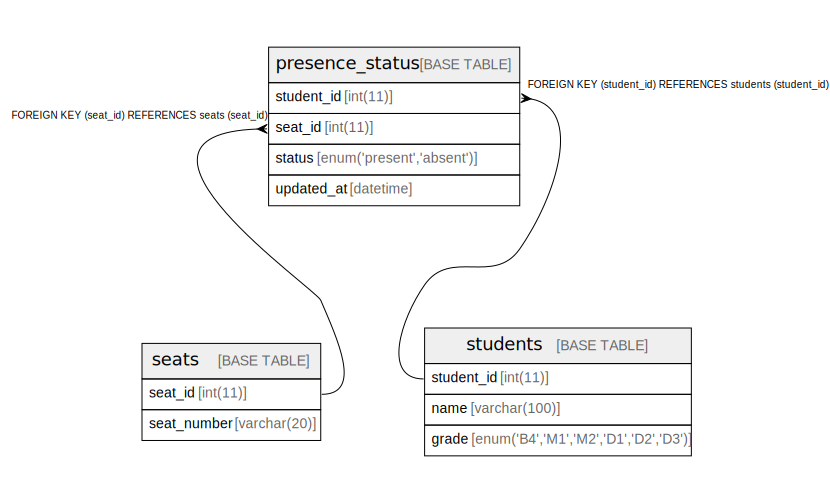

# zaiseki

研究室用の在室管理アプリです．

## 技術スタック

- Frontend: React, TypeScript, Tailwind CSS, shadcn/ui

- Backend: Flask, CGI

- Database: MariaDB

- Runtime: Apache 2.4

## 環境

- Python (推奨バージョン: 3.10, 3.11)
- Node.js (推奨バージョン: 25.x)
- MariaDB (推奨バージョン: 10.x)
- Docker / Docker Compose

## ディレクトリ構成

- `frontend/`: フロントエンド(React + Vite)
- `backend/cgi-bin/zaiseki/api/index.cgi`: CGIエントリポイント
- `backend/cgi-bin/zaiseki/api/routes/`: ページごとのAPI定義
- `backend/cgi-bin/zaiseki/api/common/`: バックエンド共通処理
- `backend/cgi-bin/zaiseki/api/services/`: 座席・学生情報を扱う共通ロジック
- `backend/pyproject.toml`: RuffとTyの設定
- `database/schema.sql`: データベーススキーマ
- `docker-compose.yml`: MariaDB, Apache, Adminerの起動設定
- `httpd.conf`: Apache設定

## 導入

### 1. リポジトリをクローン

```bash
git clone https://github.com/tkmrmr/zaiseki.git
cd zaiseki
```

### 2. .envファイルを用意

Docker Composeを使う場合はリポジトリ直下に，使わない場合は`backend/cgi-bin/zaiseki`に`.env`ファイルを作成してください．

例:

```.env
MARIADB_USER=testuser
MARIADB_PASSWORD=testpass
MARIADB_HOST=db
MARIADB_DATABASE=lab_db
MARIADB_ROOT_PASSWORD=rootpass # Docker Composeを使用しない場合は不要
```

### 3. Node.jsパッケージのインストール

```bash
cd frontend
npm install
```

## フロントエンド開発

以下のコマンドで開発サーバを起動します．

```bash
cd frontend
npm run dev
```

`/cgi-bin`へのリクエストは，デフォルトで`http://localhost`に送られます．
別のバックエンドを使う場合は，`BASE_URL`を指定してください．

```bash
cd frontend
BASE_URL=http://{BACKEND_HOST} npm run dev
```

開発中のアプリには`http://localhost:5173/zaiseki/`でアクセスできます．

主なルート:

- `/zaiseki/`: 閲覧画面
- `/zaiseki/kiosk`: 操作画面
- `/zaiseki/admin`: 管理画面

## ビルド

Reactで作成したフロントエンドを本番環境で動かすときは以下のコマンドでビルドを行ってください．

```bash
cd frontend
npm run build
```

ビルドしたファイルは`frontend/dist`に出力されます．

ローカルでビルド結果を確認する場合は以下のコマンドを実行してください．

```bash
cd frontend
npm run preview
```

なお，Docker Composeを使用する場合は`http://localhost/zaiseki/`からより本番環境に近い環境でビルド結果を確認することができます．

## 検証

フロントエンドの静的解析

```bash
cd frontend
npm run lint
```

バックエンドのlint

```bash
docker compose exec web ruff check /usr/local/apache2/cgi-bin/zaiseki/api
```

バックエンドの型チェック

```bash
docker compose exec web ty check /usr/local/apache2/cgi-bin/zaiseki/api
```

## バックエンド起動

```bash
docker compose up --build -d
```

`database/schema.sql`はDBを初回作成するときだけ自動で読み込まれ，`.env`の`MARIADB_DATABASE`で指定したDBに以下のテーブルが作成されます．



スキーマをもう一度反映したい場合は，以下のようにボリュームを削除してから起動してください．

```bash
docker compose down -v
docker compose up --build -d
```

起動される主なサービス:

- Apache: `http://localhost/zaiseki/`
- Adminer: `http://localhost:8080/`
- MariaDB: `localhost:3306`

## Basic認証

任意のページをBasic認証で保護したい場合は，`.htpasswd`ファイルを任意のディレクトリに配置し，対象ページに対応するディレクトリ(例: `backend/cgi-bin/zaiseki/api/admin`)に，以下のような`.htaccess`ファイルを置いてください．

```.htaccess
AuthUserFile <.htpasswdファイルの絶対パス>
AuthGroupFile /dev/null
AuthName "Please enter your ID and password"
AuthType Basic

<RequireAll>
    Require valid-user
    <RequireAny>
        Require ip xxx.xxx.xxx.xxx
        Require ip yyy.yyy.yyy.yyy
    </RequireAny>
</RequireAll>

```

## BOCCO emo

コミュニケーションロボット[BOCCO emo](https://www.bocco.me/)と連携し，入室時にBOCCO emoに挨拶させることができます．  
BOCCO emoを使用する場合は，`.env`に以下の変数を追記してください．

```.env
ENABLE_BOCCO=true # true or false
BOCCO_REFRESH_TOKEN=xxxxxxxx-xxxx-xxxx-xxxx-xxxxxxxxxxxx
BOCCO_ROOM_ID=xxxxxxxx-xxxx-xxxx-xxxx-xxxxxxxxxxxx
```

なお，リフレッシュトークンや部屋IDの取得については[ドキュメント](https://platform-api.bocco.me/)をご覧ください．

また，BOCCO emoの使用にはrequestsライブラリが必要です．Docker Composeを使わない場合は`pip install requests`でインストールしてください．

## 補足

- `LabMap.tsx`は研究室の配置に合わせて適宜編集してください．

- `frontend/public/.htaccess`はReact RouterをApache上で動かすための設定ファイルです．

- `backend/cgi-bin/zaiseki/api/.htaccess`はAPIリクエストを`index.cgi`に転送しFlaskアプリを動かすための設定ファイルです．

## ライセンス

このプロジェクトはMIT Licenseのもとで公開されています．
